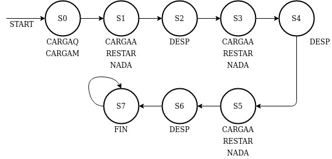
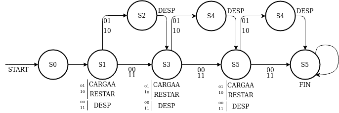
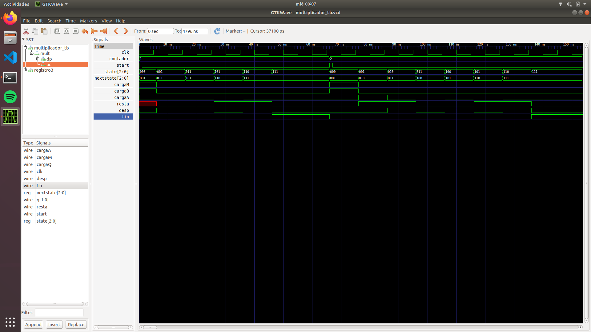

# PRÁCTICA 1: Algoritmo de Booth

## Objetivo
El objetivo de esta práctica es realizar un sistema que calcule la multiplicación de dos números con signo (3 bits en C2). Para ello, el sistema se compone de una Unidad de Control, implementada como un autómata de estados finito (máquina FSW tipo Mealy) y un camino de datos que representa las conexiones necesarias para hacer el algoritmo de multiplicación (Algoritmo de Booth).

## Modelo original
La máquina de estados que define la Unidad de Control original es la siguiente:



## Mejoras implementadas
- Hemos implementado una mejora basada en disminuir el número de estados que recorre la máquina. La máquina de estados mejorada es la siguiente:



## Compilación
Para compilar el programa, es recomendable utilizar el script de bash `output.sh`. Este script se encarga tanto de compilar y generar el fichero `multiplicador.out` como mostrar los resultados del test y generar el fichero `multiplicador_tb.vcd` para posterior análisis en el programa gtkwave.

El comando utilizado para compilar es el siguiente:
```bash

	iverilog -c datafiles.txt -o multiplicador.out multiplicador_tb.v multiplicador.v

```

El fichero `datafiles.txt` contiene una lista con todos los ficheros necesarios para compilar correctamente el multiplicador.

## Problemas ocurridos durante el desarrollo
Durante el desarrollo de este proyecto han surgido múltiples problemas, sobretodo relacionados con lo oxidado que tenía el lenguaje Verilog. De esta forma, muchos problemas eran que tenía cables sueltos, que no había conectado correctamente los bits de carga de los registros, que no sabía la diferencia entre reg y wire, etc. Sin embargo, un problema destacable fue el siguiente:

Los registros poseen un retraso de 1 ns. Esto hacía que se recibiera la señal de Fin antes de actualizarse el registro A con el último desplazamiento a la derecha. Esto se soluciono fácilmente haciendo que el cambio de estados esperara 1 ns antes de ocurrir, para sincronizarse con los cambios en los biestables.

## Información del funcionamiento del sistema
Para ilustrar el correcto funcionamiento del sistema, podemos observar los resultados mostrados por gtkwave y el resultado de la ejecución del comando `vvp multiplicador.out`:


