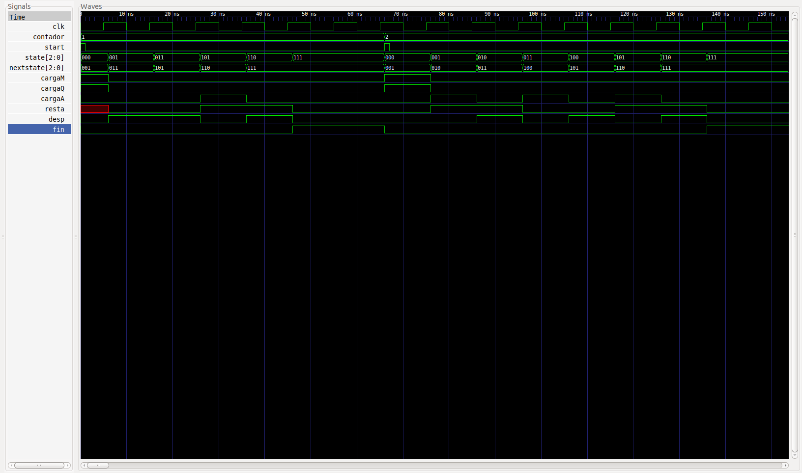

# PRÁCTICA 1: Algoritmo de Booth

## Objetivo
El objetivo de esta práctica es realizar un sistema que calcule la multiplicación de dos números con signo (3 bits en C2). Para ello, el sistema se compone de una Unidad de Control, implementada como un autómata de estados finito (máquina FSW tipo Mealy) y un camino de datos que representa las conexiones necesarias para hacer el algoritmo de multiplicación (Algoritmo de Booth).

## Modelo original
La máquina de estados que define la Unidad de Control original es la siguiente:


## Mejoras implementadas
- Hemos implementado una mejora basada en disminuir el número de estados que recorre la máquina. La máquina de estados mejorada es la siguiente:


- Se ha implementado funcionamiento en el flanco de bajada de cada ciclo de reloj. De esta forma, la Unidad de Control indica las señales correspondientes al camino de datos en el flanco de subida, y este camino efectúa las operaciones correspondientes en el flanco de bajada. En la imagen se puede ver como los cambios de los estados y la actualización del camino de datos ocurren en el flanco de bajada.


## Compilación
Para compilar el programa, es recomendable utilizar el script de bash `output.sh`. Este script se encarga tanto de compilar y generar el fichero `multiplicador.out` como mostrar los resultados del test y generar el fichero `multiplicador_tb.vcd` para posterior análisis en el programa gtkwave.

El comando utilizado para compilar es el siguiente:
```bash

	iverilog -c datafiles.txt -o multiplicador.out multiplicador_tb.v multiplicador.v

```

El fichero `datafiles.txt` contiene una lista con todos los ficheros necesarios para compilar correctamente el multiplicador.

Si queremos directamente compilar el proyecto, mostrar los resultados y generar el fichero `multiplicador_tb.vcd`, podemos utilizar el programa `output.sh` proporcionado en el proyecto. Bastará con ejecutar el siguiente comando:

```bash

	./output.sh

```

## Problemas ocurridos durante el desarrollo
Durante el desarrollo de este proyecto han surgido múltiples problemas, sobretodo relacionados con lo oxidado que tenía el lenguaje Verilog. De esta forma, muchos problemas eran que tenía cables sueltos, que no había conectado correctamente los bits de carga de los registros, que no sabía la diferencia entre reg y wire, etc. Sin embargo, un problema destacable fue el siguiente:

Los registros poseen un retraso de 1 ns. Esto hacía que se recibiera la señal de Fin (pues esta señal no posee retrasos) antes de actualizarse el registro A con el último desplazamiento a la derecha. Por tanto, el resultado de las operaciones eran el doble de lo que deberían ser, puesto que no llegó a captar el último desplazamiento hacia la derecha. Esto se soluciono fácilmente haciendo que el cambio de estados esperara 1 ns antes de ocurrir, para sincronizarse con los cambios en los biestables.

Para la mejora del flanco de bajada, tuve diversos problemas. No sabía exactamente como hacer para que funcionara. Intuía que necesitaba que las señales duraran hasta el flanco de bajada de ese mismo ciclo, pues no lo hacían. Al final la solución fue bastante sencilla: simplemente, al nanosegundo de espera entre un estado y el siguiente en la unidad de control, le añadí 5 nanosegundos más. De esta forma, antes de cambiar de estado, el sistema espera 6 nanosegundos. Ese tiempo fue suficiente para que la unidad de control se sincronizara con el camino de datos y produjera correctamente la salida esperada para cada multiplicación.

## Información del funcionamiento del sistema
Para ilustrar el correcto funcionamiento del sistema, podemos observar los resultados mostrados por gtkwave y el resultado de la ejecución del comando `vvp multiplicador.out`:



## Autor
Este proyecto se ha realizado íntegramente por el alumno **Himar Manuel Barquín Carrasco**, para la asignatura de Diseño de Procesadores del tercer año de la carrera de Ingeniería Informática de la Universidad de La Laguna.
